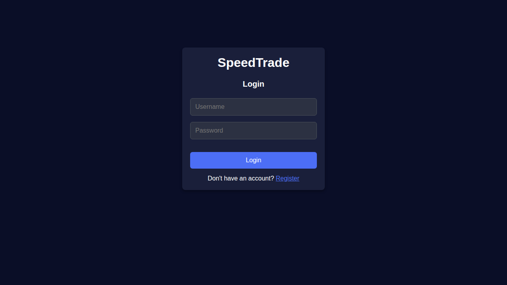
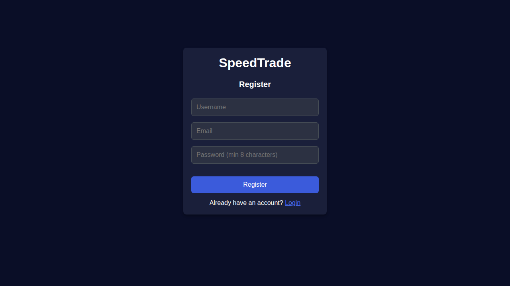

# SpeedTrade UI Demo Photos

This directory contains screenshots of the SpeedTrade application UI to showcase its features and design.

## 📸 Screenshots

### 1. Login Page

The login page features:
- Clean, modern dark theme interface
- Username and password input fields
- Prominent login button
- Link to registration for new users
- Responsive design that works on all screen sizes

**Location:** `/login`

---

### 2. Registration Page

The registration page includes:
- Username input field
- Email address field with validation
- Password field (minimum 8 characters)
- Clear call-to-action button
- Link back to login for existing users

**Location:** `/register`

---

## 🎨 Design Features

### Color Palette
- **Background:** Deep navy blue (`#1a1d29`)
- **Cards:** Dark gray (`#2d3142`)
- **Primary Button:** Vibrant blue (`#5865F2`)
- **Text:** White and light gray for contrast

### UI Components
- **Form Inputs:** Rounded corners with subtle borders
- **Buttons:** Full-width with hover effects
- **Typography:** Clean, readable sans-serif fonts
- **Layout:** Centered card-based design for focus

### User Experience
- **Dark Mode:** Eye-friendly for extended trading sessions
- **Accessibility:** High contrast ratios for readability
- **Responsive:** Mobile-first design that scales beautifully
- **Minimal:** Clean interface without distractions

## 📱 Pages Overview

### Completed Pages (Screenshots Available)
1. ✅ **Login Page** - User authentication
2. ✅ **Register Page** - New user registration

### Additional Pages (Require Authentication)
3. 🔒 **Dashboard** - Portfolio overview and quick actions
4. 🔒 **Trading Page** - Place buy/sell orders
5. 🔒 **Portfolio Page** - View positions and performance
6. 🔒 **Orders Page** - Order history and management

## 🚀 Technologies Used

### Frontend
- **React** - UI library
- **TypeScript** - Type-safe JavaScript
- **Redux Toolkit** - State management
- **React Router** - Navigation
- **Vite** - Fast build tool

### Backend
- **FastAPI** - Python web framework
- **PostgreSQL** - Database
- **JWT** - Authentication
- **WebSocket** - Real-time updates

## 📝 Notes

- Screenshots were captured from the development environment
- UI is actively being developed and may have additional features
- The application uses a dark theme optimized for trading
- All screenshots show the application running on localhost:3000

## 🔗 Related Documentation

- [START_HERE.md](../START_HERE.md) - Getting started guide
- [SPEEDTRADE_README.md](../SPEEDTRADE_README.md) - Complete application documentation
- [MVP_ARCHITECTURE.md](../MVP_ARCHITECTURE.md) - Technical architecture
- [TESTING_GUIDE.md](../TESTING_GUIDE.md) - Testing instructions

---

**Last Updated:** October 2024  
**Application Version:** MVP 1.0
